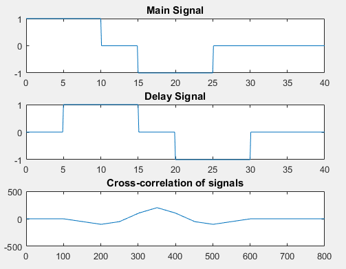
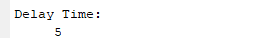

## **Roll: 1810002**
## **Course Code: ECE 4124**

### **<u>Experiment No:</u> 04**

### **<u>Experiment Date:</u> 15.05.2023**

### **<u>Experiment Name:</u> Study of time delay of a signal and cross correlation of the given signal and the delayed signal.** 

<br>


### **<u>Theory:</u>**
                 
<br>                 
    Time delay means the amount of time a signal takes to propagate itself through a system or under specified processing conditions. Time delay can occur in the various stages of signal processing such as filtering, signal transformation. It is important to consider and account for time delays in DSP applications where precise timing is important.

<br><br>
                        

Cross correlation is a mathematical operation used in signal processing and statistics to find out the similarity between two signals. It provides a measure of the correlation between two signals as a function of time or lag between them.


<br> <br>


### **<u>Code:</u>**
<br>

```
clc
clear all
t=0:0.1:40
x1=(t>=0 & t<=10);
x2=(t>=10 & t<=15);
x3=(t>=15 & t<=25);
x4=(t>=25 & t<=40);
signal1 = 1*x1+0*x2-1*x3+0*x4;
subplot(3,1,1);
plot(t,signal1);
title('Main Signal');
delay = 5;
x5=(t>=0+delay & t<=10+delay);
x6=(t>=10+delay & t<=15+delay);
x7=(t>=15+delay & t<=25+delay);
x8=(t>=25+delay & t<=40+delay);
signal2 = 1*x5+0*x6-1*x7+0*x8;
subplot(3,1,2);
plot(t,signal2);
title('Delay Signal');
signal3 = xcorr(signal1,signal2);
subplot(3,1,3);
plot(signal3);
xlim([0 800]);
title('Cross-correlation of signals');
[~, max_index] = max(signal3);

delay_time =(length(signal1)-max_index);
disp('Delay Time: ');
disp(delay_time*0.1);
```


<br><br>


### **<u>Output:</u>** 
<br>

<div align="center">

<br>
<h4> Figure-1: Input Signal, delayed signal and their corresponding cross-correlation signal. </h4> 
</div>


<br><br>

<div align="center">

<h4>Figure-2: Output of delay time for input signal and delayed signal. </h4> 

</div>
<br><br>


### **<u>Discussion & Conclusion:</u>** 
<br>
In this experiment, firstly I had plotted a square wave signal and a delayed of that corresponding square wave signal. After that I had tried to find the cross-correlation signal of those signals and also plotted that signal. Then I had tried to find the peak position of the cross-correlation signal to find the delay time. Finally by using some logical calculation I got the delay time properly. But here it should be mentioned that the position of peak of the cross-correlation signal was not completely equal to delay time.

<br><br>

